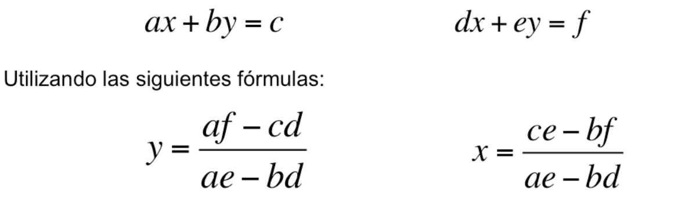

# Sistema de Ecuaciones

Modifica el programa que se encuentra en la carpeta `src` que se llama
`exercise.py` y que contiene el siguiente código:

```python
def sistema_ecuaciones( ):
    pass

def main():
    #escribe tu código abajo de esta línea
    pass

if __name__ == '__main__':
    main()
```
La línea `#escribe tu código abajo de esta línea` es un comentario,
el programa la va a ignorar al ejecutarse.

Lleva a cabo el análisis, diseño y codificación en lenguaje Python de una función llamada sistema_ecuaciones( )
La función lee los valores de los coeficientes a,b,c,d,e y f  de las
2 ecuaciones:



la función calcula los valores de y ,  x,   y posteriormente despliega el valor de *x, y*
Añade tu análisis del problema dentro del archivo

#### Entradas:
#### Salidas:
* Mensajes para ingresar los datos de Entrada:
* Mensajes para desplegar los datos de salida:
#### Procesos:

#### NOTA IMPORTANTE:
Tu programa debe incluir los mensaje para pedir los datos y
la salida debe coincidir exactamente con el formato y/o tipo de dato que se te pide como salida.

2 Ejemplos de Ejecución del programa:

```
a = 3
b = 1
c = 22
d = 4
e = -3
f = -1
x = 5.0
y = 7.0


a = 2
b = 3
c = 5
d = 5
e = 6
f = 4
x = -6.0
y = 5.666666666666667


```

**Nota:** No te preocupes por esta parte del código
`if __name__ == '__main__':` por el momento.
No la vamos a necesitar para este programa, pero es una buena práctica
incluirla y quedará más claro para que sirve en los siguientes ejercicios.

Una vez que termines tu actividad y la hayas probado con
`python -m pytest --tb=short -v`, subela a tu repositorio en GitHub,
con el proceso de commit + push.
